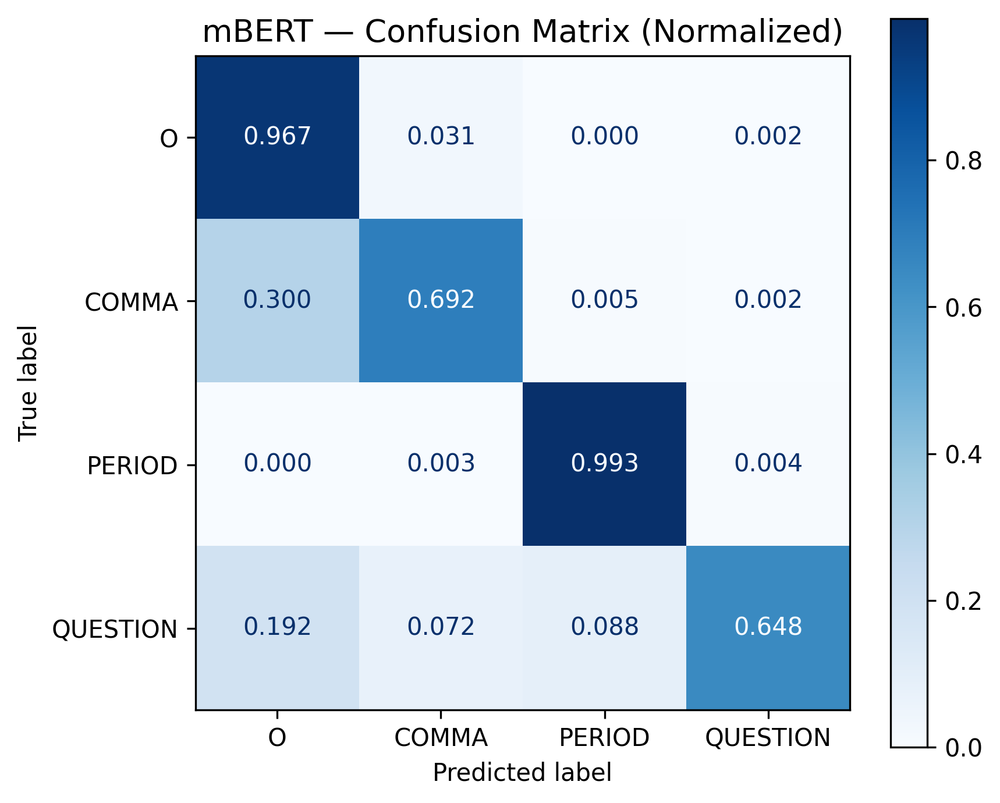
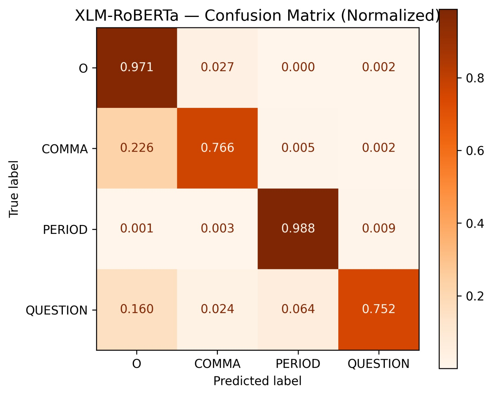

# Punctuation Restoration for Kyrgyz Language

**A Comparative Study of Multilingual Transformer Models**

The first punctuation restoration system for Kyrgyz, a low-resource agglutinative Turkic language with ~7 million speakers. We compare **mBERT** and **XLM-RoBERTa** fine-tuned on a newly constructed Kyrgyz dataset.

> Paper: *"Punctuation Restoration for Kyrgyz Language: A Comparative Study of Multilingual Transformer Models"*
> Submitted to ACM Transactions on Asian and Low-Resource Language Information Processing (TALLIP)

---

## Results

| Model | Precision | Recall | F1 (weighted) |
|-------|-----------|--------|---------------|
| Rule-based baseline | 0.801 | 0.781 | 0.790 |
| mBERT | 0.937 | 0.939 | 0.938 |
| **XLM-RoBERTa** | **0.949** | **0.950** | **0.949** |

### Per-Class Performance

| Class | mBERT F1 | XLM-RoBERTa F1 | Gap |
|-------|----------|-----------------|-----|
| O (no punctuation) | 0.963 | **0.970** | +0.7% |
| COMMA | 0.717 | **0.775** | +5.8% |
| PERIOD | **0.990** | 0.989 | -0.1% |
| QUESTION | 0.643 | **0.704** | +6.1% |

### Confusion Matrices

<p align="center">
  
  &nbsp;&nbsp;
  
</p>
<p align="center">
  <em>(a) mBERT &nbsp;&nbsp;&nbsp;&nbsp;&nbsp;&nbsp;&nbsp;&nbsp;&nbsp;&nbsp;&nbsp;&nbsp;&nbsp;&nbsp;&nbsp;&nbsp;&nbsp;&nbsp;&nbsp;&nbsp;&nbsp;&nbsp;&nbsp;&nbsp;&nbsp;&nbsp;&nbsp;&nbsp;&nbsp;&nbsp;&nbsp;&nbsp;&nbsp;&nbsp;&nbsp;&nbsp;&nbsp;&nbsp;&nbsp;&nbsp;&nbsp;&nbsp;&nbsp;&nbsp;&nbsp;&nbsp; (b) XLM-RoBERTa</em>
</p>

---

## Dataset

**14,028 sentences | 141,626 tokens** from three Kyrgyz-language sources:

| Source | Share |
|--------|-------|
| Literary texts (books) | 67.5% |
| Wikipedia | 20.0% |
| News articles | 12.5% |

**Label distribution:**

| Label | Count | Percentage |
|-------|-------|------------|
| O (no punctuation) | 111,965 | 79.1% |
| COMMA | 15,257 | 10.8% |
| PERIOD | 13,564 | 9.6% |
| QUESTION | 840 | 0.6% |

**Split:** Train 76.5% / Val 8.5% / Test 15% (`random_state=42`)

---

## Quick Start

### Training (Google Colab)

1. Open `mbert_baseline.ipynb` or `xlmr_finetune.ipynb` in Google Colab
2. Set runtime to **T4 GPU**
3. Upload `train_data.json` when prompted
4. Run all cells

### Inference

```python
from transformers import AutoTokenizer, AutoModelForTokenClassification
import torch

model_name = "YOUR_HF_USER/xlmr-kyrgyz-punctuation"  # or mbert-kyrgyz-punctuation
tokenizer = AutoTokenizer.from_pretrained(model_name)
model = AutoModelForTokenClassification.from_pretrained(model_name)

ID2LABEL = {0: 'O', 1: 'COMMA', 2: 'PERIOD', 3: 'QUESTION'}

text = "Бүгүн аба ырайы жакшы болду"
inputs = tokenizer(text.split(), is_split_into_words=True, return_tensors="pt")

with torch.no_grad():
    logits = model(**inputs).logits
    preds = torch.argmax(logits, dim=-1)[0]

word_ids = inputs.word_ids()
for i, (wid, pred) in enumerate(zip(word_ids, preds)):
    if wid is not None and (i == len(word_ids) - 1 or word_ids[i + 1] != wid):
        label = ID2LABEL[pred.item()]
        punct = {'PERIOD': '.', 'COMMA': ',', 'QUESTION': '?'}.get(label, '')
        print(f"{text.split()[wid]}{punct}", end=" ")
```

---

## Training Configuration

| Parameter | Value |
|-----------|-------|
| Max sequence length | 256 |
| Batch size | 16 |
| Learning rate | 5e-5 |
| Optimizer | AdamW |
| Weight decay | 0.01 |
| Warmup ratio | 0.1 |
| Epochs | 5 |
| Precision | FP16 |
| Hardware | Google Colab T4 GPU |
| Best checkpoint | `load_best_model_at_end` (weighted F1) |

---

## Repository Structure

```
.
├── train_data.json              # Kyrgyz punctuation dataset (14K sentences)
├── mbert_baseline.ipynb         # mBERT training & evaluation notebook
├── xlmr_finetune.ipynb          # XLM-RoBERTa training & evaluation notebook
├── main.tex                     # Paper source (LaTeX)
├── references.bib               # Bibliography
├── confusion_matrix_mbert.png   # mBERT confusion matrix
└── confusion_matrix-Roberta.jpeg # XLM-RoBERTa confusion matrix
```

## Models on HuggingFace

| Model | Parameters | F1 | Link |
|-------|-----------|-----|------|
| mBERT (bert-base-multilingual-cased) | 177M | 0.938 | [HuggingFace](https://huggingface.co/YOUR_HF_USER/mbert-kyrgyz-punctuation) |
| XLM-RoBERTa-base | 270M | 0.949 | [HuggingFace](https://huggingface.co/YOUR_HF_USER/xlmr-kyrgyz-punctuation) |

---

## Key Findings

- **XLM-RoBERTa outperforms mBERT** across most classes, benefiting from Kyrgyz text in its pre-training data
- **Period restoration is near-perfect** (F1 > 99%) for both models, driven by strong sentence-final verb cues
- **Comma prediction is hardest** (F1: 77.5%) due to ambiguous converb clause boundaries in Kyrgyz
- **Question marks are rare** (0.6% of tokens) and show the largest inter-model gap (+6.1% F1)

---

## Citation

```bibtex
@article{uvalieva2025kyrgyz,
  title   = {Punctuation Restoration for Kyrgyz Language: A Comparative Study of Multilingual Transformer Models},
  author  = {Uvalieva, Zarina},
  journal = {ACM Transactions on Asian and Low-Resource Language Information Processing},
  year    = {2025}
}
```

## License

This dataset and code are released for research purposes. Please cite our paper if you use them in your work.
